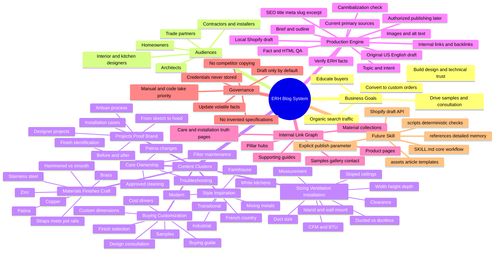

# ERH Blog 思维地图

```mermaid
mindmap
  root((ERH Blog System))
    Business Goals
      Organic search traffic
      Educate buyers
      Build design and technical trust
      Drive samples and consultation
      Convert to custom orders
    Audiences
      Homeowners
      Interior and kitchen designers
      Architects
      Contractors and installers
      Trade partners
    Content Clusters
      Sizing Ventilation Installation
        Measurement
        Clearance
        Width height depth
        CFM and BTU
        Duct size
        Ducted vs ductless
        Island and wall mount
        Sloped ceilings
      Materials Finishes Craft
        Copper
        Stainless steel
        Brass
        Zinc
        Patina
        Hammered vs smooth
        Straps rivets pot rails
      Style Inspiration
        Modern
        Farmhouse
        French country
        White kitchens
        Industrial
        Transitional
        Mixing metals
      Buying Customization
        Buying guide
        Cost drivers
        Samples
        Custom dimensions
        Finish selection
        Design consultation
      Care Ownership
        Finish identification
        Approved cleaning
        Filter maintenance
        Patina changes
        Troubleshooting
      Projects Proof Brand
        Before and after
        Designer projects
        From sketch to hood
        Artisan process
        Installation cases
    Production Engine
      Topic and intent
      Cannibalization check
      Verify ERH facts
      Current primary sources
      Brief and outline
      Original US English draft
      Images and alt text
      SEO title meta slug excerpt
      Internal links and backlinks
      Fact and HTML QA
      Local Shopify draft
      Authorized publishing later
    Internal Link Graph
      Pillar hubs
      Supporting guides
      Material collections
      Product pages
      Samples gallery contact
      Care and installation truth pages
    Governance
      No competitor copying
      No invented specifications
      Manual and code take priority
      Draft only by default
      Credentials never stored
      Update volatile facts
    Future Skill
      SKILL.md core workflow
      references detailed memory
      scripts deterministic checks
      assets article templates
      Shopify draft API
      Explicit publish parameter
```

## 生产闭环

```mermaid
flowchart LR
    A["Topic or Product"] --> B["Intent and Existing Page Audit"]
    B --> C["Verify ERH Facts and Current Sources"]
    C --> D["Brief Outline and Image Plan"]
    D --> E["Original English Article"]
    E --> F["SEO Fields and Shopify HTML"]
    F --> G["Internal Links and Back-link Tasks"]
    G --> H["Fact Link Format QA"]
    H --> I["Local Draft"]
    I --> J["Content Test"]
    J --> K["Skill Packaging"]
    K --> L["Shopify Draft Connection"]
    L -. "explicit approval" .-> M["Publish"]
    J -->|feedback| B
```
